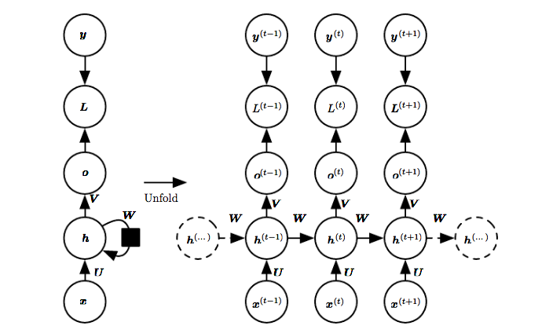

# Recurrent Neural Networks
## Outline

<!-- MarkdownTOC -->

- Introduction
	- Sequences of Vectors
	- Key concept of an RNN
	- Backpropagation through time
- Example Applications of RNNs
	- One-to-One Sequences
	- One-to-Many Sequences
	- Many-to-One Sequences
	- Many-to-Many Sequences
- Advanced Topics
	- Long Short Term Memory \(LSTM\)
	- Attention
	- Peepholes
	- Gated Recurrent Units
- Resources
	- Aggregated resources
	- Additional tutorials
	- Literature

<!-- /MarkdownTOC -->

## Introduction

"Recurrent neural networks or RNNs are a family of *neural networks for processing sequential data*. Mu
ch as a convolutional network is a neural network that is specialized for processing a grid of values X such as an image, a recurrent neural network is a neural network that is specialized for processing a sequence of values x(1), . . . , x(τ)." Ian Goodfellow [The Deep Learning Book](http://www.deeplearningbook.org/contents/rnn.html)

"Unlike a traditional deep neural network, which uses different parameters at each layer, a RNN shares the same parameters (U, V, W above) across all steps. This reflects the fact that we are performing the same task at each step, just with different inputs. This greatly reduces the total number of parameters we need to learn." [Denny Britz](http://www.wildml.com/2015/09/recurrent-neural-networks-tutorial-part-1-introduction-to-rnns/)

### Sequences of Vectors
"The core reason that recurrent nets are more exciting is that they allow us to operate over sequences of vectors: Sequences in the input, the output, or in the most general case both." Andrej Karpathy [link](http://karpathy.github.io/2015/05/21/rnn-effectiveness/)

Figure. Each rectangle is a vector and arrows represent functions (e.g. matrix multiply). Input vectors are in red, output vectors are in blue and green vectors hold the RNN's state

### Key concept of an RNN

Two representations of the basic RNN architecture. On the left, the RNN is drawn with recurrent connections and on the right, it is drawn as a time-series unfolded computational graph. Each x-value represents one time point, such as for example, a word in a sentence or measurement at a time t. The hidden layer, h, is updated based on the input of each point, thereby effectively giving the network the capacity to consider memory from inputs earlier in the sequence at any point later in the sequence. 

The input x is used to produce an output o via the hidden layer, h. The output is compared to the actual values y and loss function L measures how far o and y deviate from each other. 

[The Deep Learning Book](http://www.deeplearningbook.org/contents/rnn.html)

### Backpropagation through time

Because RNNs try to capture information from previous timesteps, backpropagation takes on a modified form. In this case, gradients for the current hidden node take into consideration gradients from previous hidden states. As such, backpropagation through time sums the gradients that determine the weights on the hidden cell at the current time. While in theory, this is able to capture the long-term memory, vanilla RNNs in practice have a difficult time doing so. In current practice, specialized methods such as LSTM and GRU are deployed in order to better capture long-range memory. Read more about Backpropagation through time in Denny Britz's excellent [blog article](http://www.wildml.com/2015/10/recurrent-neural-networks-tutorial-part-3-backpropagation-through-time-and-vanishing-gradients/).

## Example Applications of RNNs

### One-to-One Sequences
Description: from fixed-sized input to fixed-sized output. The Vanilla mode of processing without RNN.

Use cases: image classification.

### One-to-Many Sequences
Description: sequence output.

Use cases: image captioning, where the input is an image and the output is a sentence of words that describes the image. 
Speech recognition

### Many-to-One Sequences
Description: sequence input.

Use cases: Sentiment analysis, where a given body of text is classified as expressing positive or negative sentiment.

Code/tutorials:
- [Sentiment analysis using LSTM](http://deeplearning.net/tutorial/lstm.html) 

- [Language modelling using tensorflow](https://www.tensorflow.org/tutorials/recurrent)

### Many-to-Many Sequences
#### Asynchronous Sequences
Description: Sequence input and sequence output.

Use cases: Machine translation, where an RNN reads a sentence in English and then outputs a sentence in a different language.

Code/tutorials:
- [LSTM text generation using theano/lasagne](http://deeplearning.net/tutorial/lstm.html) based on Karpathy's char-rnn

#### Synchronous Sequences
Description: Synced sequence input and output.

Use cases: Video classification, where we wish to label each frame of the video.

- insert more material here

## Advanced Topics 

### Long Short Term Memory (LSTM)
[the bible](http://colah.github.io/posts/2015-08-Understanding-LSTMs/)

### Attention
Attention can be applied to various advanced topics of RNNs. For example, it can be used to read and write from a memory vector using Neural Turing Machines or be leveraged to get the network to focus on a particular section of the input. [Need general introduction to attention systems here]

Read more [here.](http://distill.pub/2016/augmented-rnns/)

### Peepholes
Peephole connections pass directly from the internal state to the input and output gates of that same node without first having to be modulated by the output gate. 
For example, "Consider a network which must learn to count objects and emit some desired output when n objects have been seen. The net- work might learn to let some fixed amount of activation into the internal state after each object is seen. This activation is trapped in the internal state sc by the constant error carousel, and is incremented iteratively each time another object is seen. When the nth object is seen, the network needs to know to let out content from the internal state so that it can affect the output. To accomplish this, the output gate oc must know the content of the internal state sc. Thus sc should be an input to oc." From Review Paper below. 

### Gated Recurrent Units
GRUs are a newer version of LSTMs, introduced only in 2014. GRUs also use gates in order to determine how much of the input and memory is communicated in the present hidden state. They are simpler than LSTM nodes since they have less gates and there is no separate internal memory. They can be applied in much the same way as LSTMs and there are no clear guidelines with regards to when to use LSTM vs. when to use GRUs. 

More details once again in Denny Britz's [blog](http://www.wildml.com/2015/10/recurrent-neural-network-tutorial-part-4-implementing-a-grulstm-rnn-with-python-and-theano/).

## Resources 
### Aggregated resources

[Aggregate](https://github.com/kjw0612/awesome-rnn) of RNN resources

[Aggregate](http://yerevann.com/a-guide-to-deep-learning/) of general NN resources, including section on RNNs

### Additional tutorials

[Four part RNN tutorial](http://www.wildml.com/2015/09/recurrent-neural-networks-tutorial-part-1-introduction-to-rnns/) using Python and Theano by Denny Britz

[Building an RNN from the ground up in tensorflow](https://r2rt.com/recurrent-neural-networks-in-tensorflow-i.html)

[Implementation of Google's DRAW: Deep Recurrent Attentive Writer for image generation](http://blog.evjang.com/2016/06/understanding-and-implementing.html)

### Literature
[Review Paper on RNNs](https://arxiv.org/abs/1506.00019) by Lipton, Berkowitz, and Elkan. 2015.
