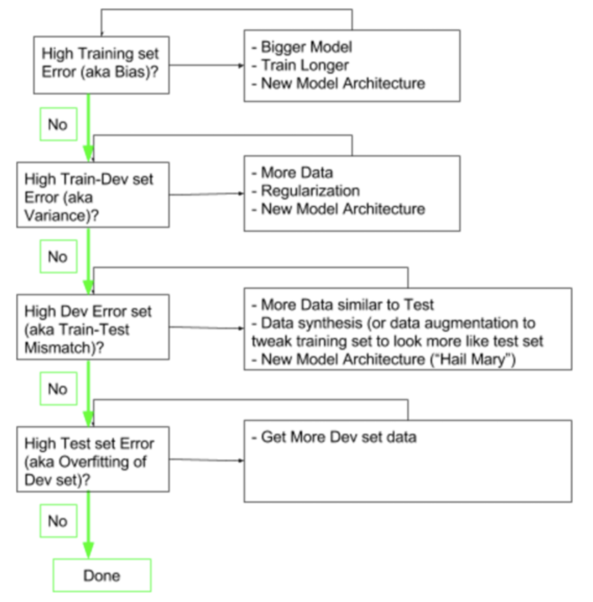

# Optimizing and troubleshooting Deep Learning models 

See more notes [here ](https://docs.google.com/document/d/1xbzRHgHPFdj7Z6nHleqqQgvqkf-iwdiTC7rI00KBHE4/edit#heading=h.rpxlj16djj12)(for internal use only)

Measure the following variables: 

1. Human level error (on training-dev set) 

2. Training set error 

3. Training-Dev set error 

4. Dev set error 

5. Test set error 

* Difference between 1) and 2) is your Bias

* Difference between 2) and 3) is your Variance.

* Difference between 3) and 4) is your Train-Test mismatch.

* Difference between 4) and 5) is your Overfitting of Dev.

These factors will tell you where to go next:

## Measuring error in language modelling

Working with text prediction, there are a number of challenges in applying the above framework for troubleshooting your error rates. 

Challenges: 
- Accuracy of letter prediction is only of limited utility
- Very difficult to estimate human level error rate

What I was able to do: 
- Noticed mismatch between training and validation error
	- Training accuracy: 72%
	- Dev accuracy: 56%
	- likely overfit, introduced dropout
- Accuracy steadied out:
	- Training accuracy: 61%
	- Dev accuracy: 60%

Applied Karpathy's settings from [his blog](http://karpathy.github.io/2015/05/21/rnn-effectiveness/): 
- 3 layer LSTM RNN
- using 0.5 dropout
- 512 hidden units
- increased training set size

Sample output - exercise: based on the following three paragraphs, which do you deem to be the best generated language? 
----- diversity: 0.5
* n about technology 
* meagan : that’s a good one! has “gaming” in any way influence to be in the oddain. so far evil watercooler are doing this morning 
* meagan : i deserved that as imole was the spientification of the political employees someone started to a creation? 
* agentdave : wiilined in the past privacy really show up and after the guy is still troaling 
* jtopjian : you could try and data come summit had to be insubs with every the complaints depend and people would to meagan 

----- diversity: 0.5

* lethem novel where an out of control summit? 
* meagan : (and they were been still the to make it 
* agentdave : i think you can use the facebook and i dont think they do that they are a film compone a complete were 
* alyssa : i should have sure how that i was a copyrated in popchical the moment of the surface of web address a precord of what what's the summit) 
* meagan : what is a times to the canadian brain 
* alyssa : did you mean 
* meagan : hah

 ----- diversity: 0.5
* that leap for the company is its already-announced intention of making 25 mbps available across the law 
* meagan : we really know that the heck is in the badger 
* preethi : : so the documentary is free, computers are really sure 
* alyssa : ok micheal? the cute of manatees 
* alyssa : oh man 
* alyssa : so good as a technology connection is the world thing and he was all of the full begk for my and 20 months 
* agentdave : i've trees that the last time of the treber he very seem the emoji on the show. yep i

.

These were constructed with the following parameters: 

Paragraph 1: 
1 LSTM layer, 100 max length, no dropout, 128 hidden units (smaller training set)

Paragraph 2: 
1 LSTM layer, 40 max length, no dropout, 128 hidden units (larger training set)

Paragraph 3: 
3 LSTM layers, 100 max length, dropout, 512 hidden units (larger training set)

While paragraph 3 performed best, the increase in training set size seemed to have played a larger role in achieving better results compared to increasing the complexity of the model. 

--> maybe training set size more important than model configuration??
